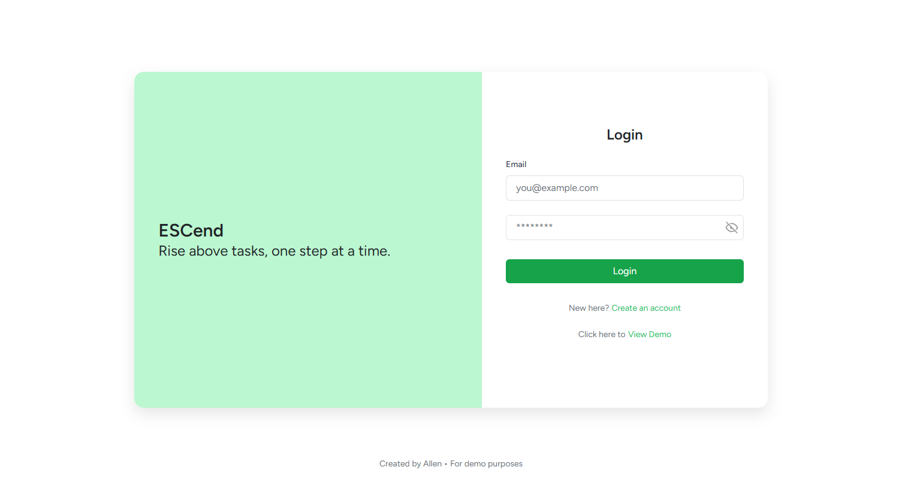
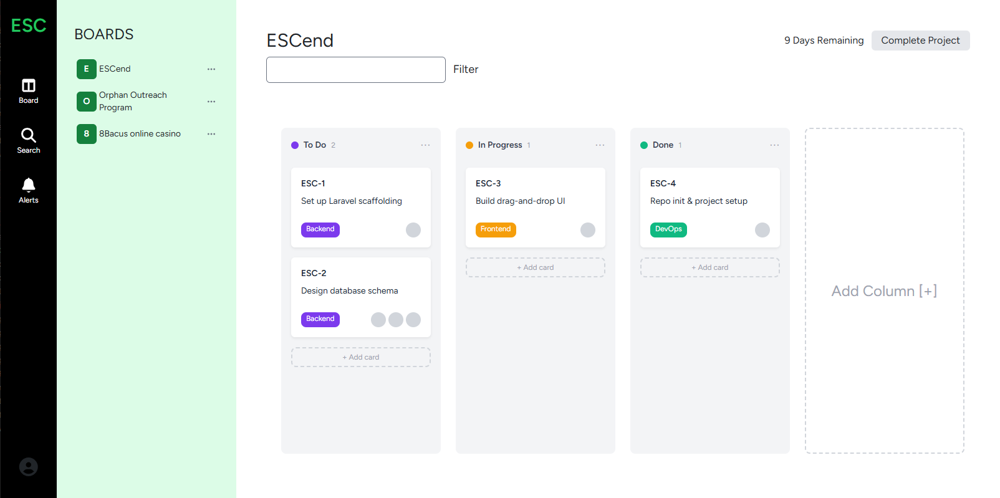
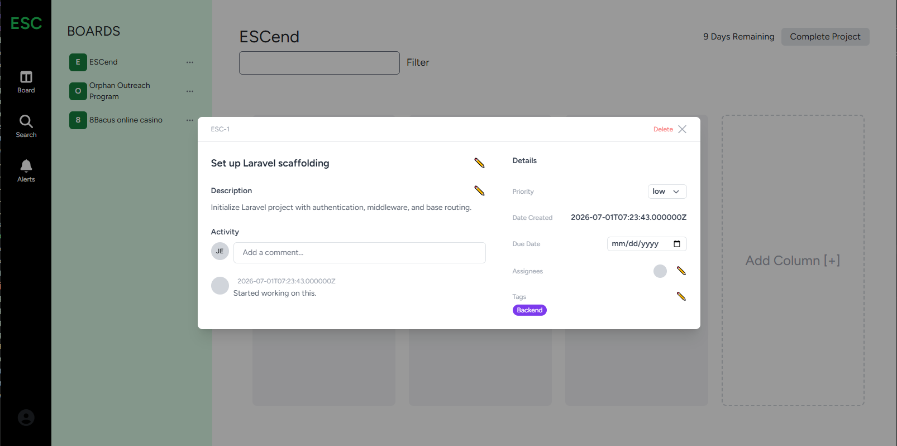

# ESCend

A modern Single Page Application (SPA) built with Laravel, React, and Inertia.js for managing tasks through an intuitive Kanban board workflow.

ESCend is a portfolio project built entirely from scratch to demonstrate my approach to designing and developing a maintainable full-stack application. The project focuses on clean architecture, separation of concerns, and modern development practices while delivering a responsive and interactive user experience.

---

## Demo

The application includes a built-in **View Demo** option that allows reviewers to explore the project immediately without creating an account.

Instead of requiring registration, the demo authenticates users into a pre-configured workspace populated with sample boards, columns, and cards, allowing the application's functionality to be evaluated instantly.

---

## Features

### Authentication

- User Login
- Built-in Demo Workspace

### Board Management

- Create Boards
- Rename Boards
- Delete Boards
- Share Boards via Link

### Column Management

- Create Columns
- Update Columns
- Delete Columns

### Card Management

- Create Cards
- Update Cards
- Delete Cards
- Drag & Drop Card Movement
- Card Descriptions
- Card Priority
- Card Labels

### Technical Features

- Laravel FormRequest validation classes
- Service Layer Architecture
- React Context API
- TypeScript
- Inertia.js SPA
- RESTful API endpoints
- SQLite database
- Database migrations
- Database seeders

---

## Tech Stack

| Technology | Purpose |
|------------|---------|
| Laravel 12 | Backend framework |
| PHP 8.2+ | Server-side language |
| React 18 | Frontend framework |
| TypeScript | Static typing |
| Inertia.js | SPA architecture |
| Vite | Frontend bundler |
| SQLite | Default database |
| Eloquent ORM | Database interaction |
| Tailwind CSS | Utility-first styling |
| Bootstrap 5 | Existing UI components |
| React Bootstrap | React UI components |
| dnd-kit | Drag-and-drop interactions |
| Docker | Deployment environment |
| Render | Cloud deployment |

---

## Project Architecture

The backend follows Laravel's MVC architecture while introducing a dedicated service layer to separate business logic from request handling.

```
HTTP Request
      │
      ▼
Controller
      │
      ▼
FormRequest Validation
      │
      ▼
Service Layer
      │
      ▼
Eloquent Models
      │
      ▼
SQLite Database
```

### Backend

The backend is organized around resource-based controllers, dedicated FormRequest validation classes, service classes, and Eloquent models.

Responsibilities are intentionally separated:

- Controllers receive and process HTTP requests.
- FormRequest classes handle validation.
- Service classes contain business logic.
- Eloquent models manage database interaction.

This keeps controllers concise while allowing business logic to remain reusable and easier to maintain.

### Frontend

The frontend follows a layered structure.

```
Pages
Components
APIs
Context
Interfaces
```

API communication is encapsulated in dedicated Axios modules while React components remain focused on rendering and user interaction.

State is managed as close to its owner as possible, with React Context introduced only where shared state genuinely benefits multiple components.

---

## Screenshots

### Landing Page



### Dashboard


### Board



### Card Details



---

## Installation

### Requirements

- PHP 8.2+
- Composer
- Node.js
- npm

### Clone the repository

```bash
git clone https://github.com/yourusername/ESCend.git

cd ESCend
```

### Install dependencies

```bash
composer install

npm install
```

### Configure environment

```bash
cp .env.example .env

php artisan key:generate
```

### Database

ESCend uses **SQLite** by default.

Run the migrations and seed the database.

```bash
php artisan migrate --seed
```

### Start the application

```bash
npm run dev

php artisan serve
```

The application will now be available locally.

---

## Deployment

ESCend is containerized using Docker and deployed on Render.

Deployment automatically executes database migrations and seeders, ensuring the application is immediately usable after deployment.

---

## Phase 2 Roadmap

### Authentication

- User Registration
- Edit Profile
- Password Reset
- Email Verification

### Board Management

- Dynamic Label Management

### Card Management

- Comments
- Card Assignees

### User Experience

- Responsive Layout
- Dark Mode
- Notifications
- Search & Filtering
- Loading Animations

### Quality

- Automated PHPUnit Tests

---

## Project Goals

The objective of ESCend extends beyond implementing Kanban functionality.

The project serves as a practical demonstration of building a modern Laravel and React application using clean architecture principles, maintainable project organization, and thoughtful engineering decisions.

Key areas of focus include:

- Separation of concerns
- Service-oriented backend architecture
- Organized React component hierarchy
- Strong typing with TypeScript
- Maintainable request validation
- Efficient frontend state management
- Production-style deployment workflow

---

## License

This project is licensed under the MIT License.